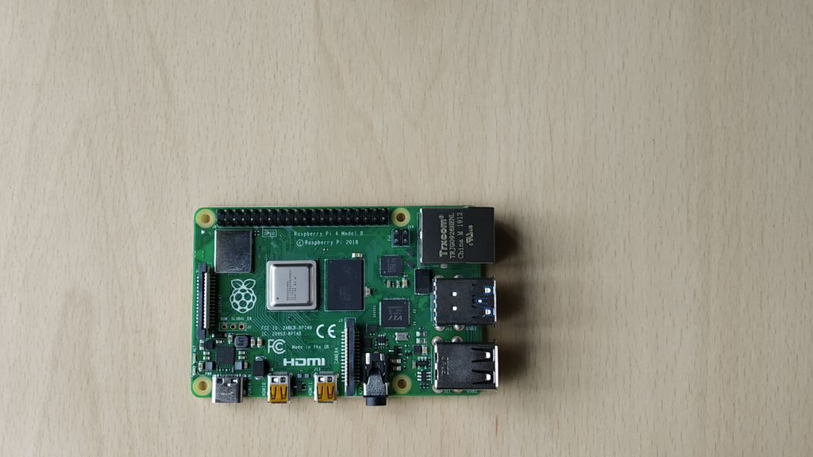
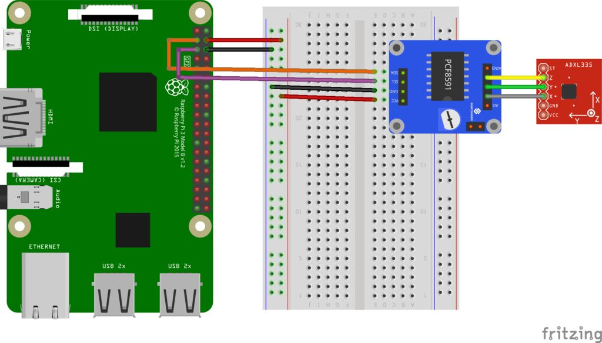

### Template

#### Instructions:

- This is a readme file in markdown format (readme.md) which should be in your github/gitlab repository. later you can add your project files into the repository.

- Fork this project and edit this file for your blog

- Add your images in the `images` folder of this repository . 
  >  ``

- You can [creatively ](https://pandao.github.io/editor.md/en.html)
 add more information so that the reader will get the most out of it.

- remove all the instructions before posting the blog


# Interfacing 'Sensor Name' with 'Board Name' using Shunyainterfaces




>Add the image of the board or the your group working on shunya interfaces

## Introduction

 We are going to interface an ADXL335 (accelerometer) sensor on Raspberry Pi 4 with Shunya O/S

> Add the description of your project and is applications


# Materials required :
- Raspberry Pi 4B
- Raspberry Pi 4B compliant power supply
- 8GB or bigger micro SD card


# Connections :

> Add a photo of your fully connected circuit.

- connection between raspberrypi and pcf8591 


| PCF8591 |     -    |Raspberry Pi 4 |
| ------  | ---- |------- |
| SDA     | <---->  | Pin 3 |
| SCL     | <---->  | Pin 5 |
| VCC     | <---->  | Vcc |
| GND     | <-----> | GND |

- connection between  pcf8591 and ADXL355

| PCF8591 |   -      |ADXL355 |
| ------  | ----  |------- |
| Ain1     | <---->  | X |
| Ain2    | <---->  | Y |
| Ain3     | <---->  | Z |

> you can create tables using this syntax


# Procedure 

## Step 1: Install Shunya os on Raspberry pi 4
1. Download Shunya OS from the [official release site](http://shunyaos.org/beta-release/)
2. Shunya OS guys have a decent tutorial on [Flashing Shunya OS on Raspberry Pi 4.](http://docs.shunyaos.org/boards/Raspberry-Pi-4.ht)
3. Insert micro SD card into Raspberry Pi 4


## Step 2: Install Shunya Interfaces
1. Connect to the wifi using the command
```
    $ nmtui
```
2. Installing the Shunya Interfaces is easy, just run the command  
```   
 $ sudo apt install shunya-interfaces
```

> Add more Steps as per the project 


# Code :

```c

#include<stdio.h>
#include<stdlib.h>

#include<shunyaInterfaces.h>
#include<pcf8591.h>


void main(){
        int x,y,z;
        /*Initialize Shunya Interfaces library*/
        shunyaInterfacesSetup();
        pcf8591Setup();
        while (1)
        {
                x = pcf8591Read(A1);
                y = pcf8591Read(A2);
                z = pcf8591Read(A3);
                /* Reading converted value at pins of ADC whose addresses 
                 * are given by 0x01, 0x10, 0x11
                 */
                printf("X pin : %d\n",x); 
                delay(100);
                printf("Y pin : %d\n",y); 
                delay(100);
                printf("Z pin : %d\n",z);
                delay(1000);
        }
}

```
# Credits :

Check out this cool new library for creating your own iot projects - [Shunyainterfaces](https://github.com/shunyaos/Shunya-Interfaces)

Checkout this blog : [Interface ADXL335 Sensor on Raspberry Pi 4B in 4 Steps](https://www.instructables.com/id/Interface-ADXL335-Sensor-on-Raspberry-Pi-4B-in-4-S/)


[@ShunyaOS](http://shunyaos.org/) || [@iotiot.in](http://iotiot.in/)


#
